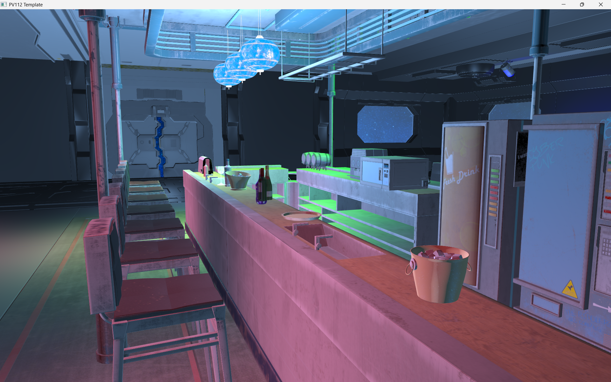

## About
This repository consists of projects from computer graphics courses at Masaryk University throughout several semesters.
These projects usually require an undisclosed framework to build and run. 
Each folder contains code for a separate project.

## Space Bar
**Forward-rendered bar flying through space**
*Semester: Autumn 2023*
Details: 
- blinn-phong lighting
- animated lights of various types (cone, directional, point)
- environmental reflection (skybox)
- transparent objects

